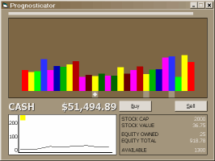



## Prognosticator

### Description

This is actually experimental code. I attempted to reuse a form by putting code in classes (just to see what the pitfalls are, etc...) For the experiment I created a simple game. Buy and sell stocks as their prices rise and fall. Predict which stocks are on the rise and invest in those for higher scores. Again, a simple game to test class based coding. Have fun!
 
### More Info
 

             |
---                |---
**Submitted On**   |2009-01-11 06:45:04
**By**             |[Larry Serflaten](https://github.com/Planet-Source-Code/PSCIndex/blob/master/ByAuthor/larry-serflaten.md)
**Level**          |Intermediate
**User Rating**    |5.0 (10 globes from 2 users)
**Compatibility**  |VB 5\.0, VB 6\.0
**Category**       |[Games](https://github.com/Planet-Source-Code/PSCIndex/blob/master/ByCategory/games__1-38.md)
**World**          |[Visual Basic](https://github.com/Planet-Source-Code/PSCIndex/blob/master/ByWorld/visual-basic.md)
**Archive File**   |[Prognostic2140191112009\.zip](https://github.com/Planet-Source-Code/larry-serflaten-prognosticator__1-71632/archive/master.zip)

